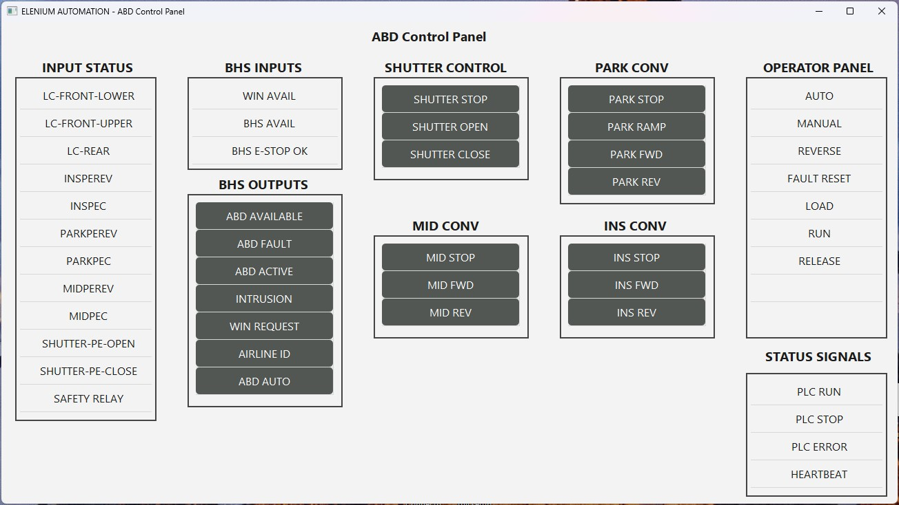
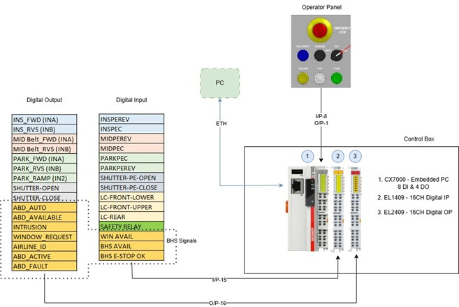

# CX7000 PLC Control System with Python GUI (pyads)

## 📌 Overview
This project demonstrates a complete control and monitoring solution for a **Beckhoff CX7000 PLC** using a custom-built **Python GUI**. Communication between the PC and PLC is established via the **ADS protocol** using the `pyads` library.

The system was specifically designed to:
- **Test and validate Automatic Bag Drop (ABD) PLC operations**
- **Simulate communication between PLC and an airport CUSS (Common Use Self Service) platform running on a PC**

This makes the solution highly relevant for **airport automation environments**, where reliable PLC–PC interaction is critical.

---

## 🎯 Key Objectives
- Provide a **test platform for ABD control systems**
- Simulate **real-world airport CUSS software interactions**
- Enable **offline testing and commissioning support**
- Reduce dependency on live airport systems during development

---

## 🚀 Features
- Real-time communication with PLC via ADS (port 851)
- Python-based GUI for control and monitoring
- Read/Write PLC variables (BOOL, INT, REAL, etc.)
- Simulation of CUSS platform signals and responses
- Connection status monitoring (heartbeat implementation)
- Event-driven updates and periodic polling
- Scalable architecture for industrial automation applications

---

## 🛠️ Technologies Used
- PLC: Beckhoff CX7000 (TwinCAT 3)
- Communication: ADS Protocol
- Python Libraries:
  - `pyads`
  - `PyQt6` (or Tkinter – update if needed)
- Development Tools:
  - TwinCAT 3 (Visual Studio)
  - Python 3.x

---

## 🖥️ GUI Preview

---

## 🔌 System Architecture

---

## ⚙️ How It Works

1. The Python GUI establishes an ADS connection to the PLC using:
   - AMS Net ID
   - IP Address
   - Port: 851

2. The application simulates a **CUSS platform** by:
   - Sending control commands 
   - Emulating passenger interaction signals
   - Receiving status feedback from the PLC

3. PLC variables are accessed via:
   - Global Variable List (GVL)
   - Symbolic variable names

4. Data exchange:
   - Read system states (sensors, conveyor status, faults)
   - Write control commands from GUI to PLC

5. Heartbeat mechanism:
   - Python toggles a variable periodically
   - PLC monitors communication health

---
